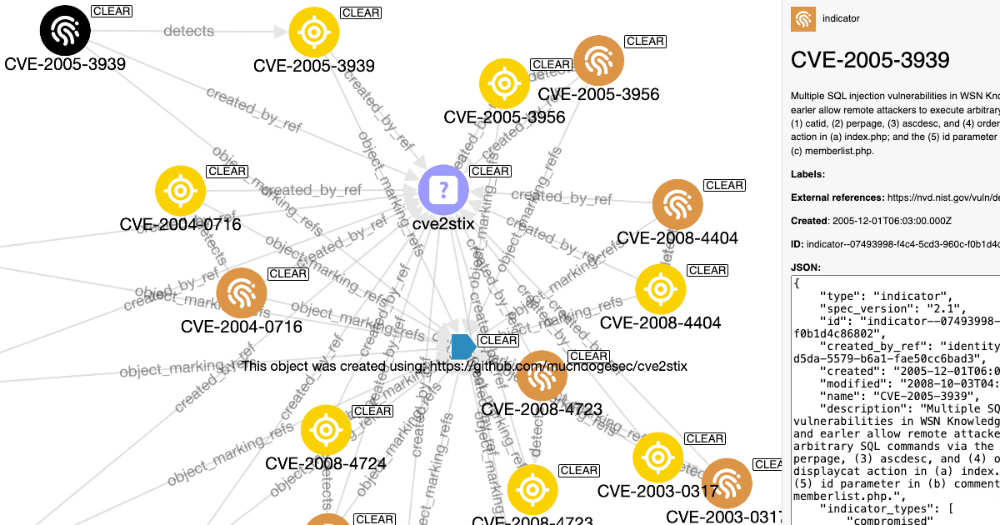

# cve2stix

## Before you begin

We host a full web API that includes all objects created by cve2stix, [Vulmatch](https://www.vulmatch.com/).

## Overview



A command line tool that turns NVD CVE records into STIX 2.1 Objects.

> The mission of the CVE® Program is to identify, define, and catalog publicly disclosed cybersecurity vulnerabilities. There is one CVE Record for each vulnerability in the catalog. The vulnerabilities are discovered then assigned and published by organizations from around the world that have partnered with the CVE Program. Partners publish CVE Records to communicate consistent descriptions of vulnerabilities. Information technology and cybersecurity professionals use CVE Records to ensure they are discussing the same issue, and to coordinate their efforts to prioritize and address the vulnerabilities.

Source: https://www.cve.org/About/Overview

CVE records are currently published to the NVD API, but are in a custom schema.

We had a requirement to have an up-to-date copy of NVD CVEs in STIX 2.1 format for easy dissemination to downstream system.

The code in this repository turns CVEs into STIX 2.1 objects, and keeps them updated to match the official CVE API;

1. Downloads the current CVEs (that match a users filters) from the NVD API
2. Converts them to STIX 2.1 Objects
3. Stores the STIX 2.1 Objects in the file store
4. Creates STIX Bundles of generated objects for each update run

## tl;dr

[](https://www.youtube.com/watch?v=j8DWB7QF95g)

[Watch the demo](https://www.youtube.com/watch?v=j8DWB7QF95g).

## Install the script

```shell
# clone the latest code
git clone https://github.com/muchdogesec/cve2stix
# create a venv
cd cve2stix
python3 -m venv cve2stix-venv
source cve2stix-venv/bin/activate
# install requirements
pip3 install -r requirements.txt
```

You will also need to have redis installed on your machine. [Instructions to do this are here](https://redis.io/docs/getting-started/installation/).

If you're on Mac, like me, the easiest way to do this is;

```shell
brew install redis
```

## Setup configoration options

You will need to create an `.env` file as follows;

```shell
cp .env.example .env
```

You will then need to set te variables as follows;

* `NVD_API_KEY` (required): your NVD API key. Get one for free here: https://nvd.nist.gov/developers/start-here
	* note, the script will work without it, but it is very likely you will run into rate limit errors.
* `CVE_LAST_MODIFIED_EARLIEST` (required): the earliest date you want results for. CVEs with a value less than `vulnerabilities.cve.lastModified` time will be ignored. Enter in format `YYYY-MM-DDThh:mm:ss`.  Note, the script will use the NVD APIs `lastModStartDate` parameter for this.
* `CVE_LAST_MODIFIED_LATEST` (required): default is script run time. CVEs with a `vulnerabilities.cve.lastModified` greater than the time entered will be ignored. Enter in format `YYYY-MM-DDThh:mm:ss`. Note, the script will use the NVD APIs `lastModEndDate` parameter for this.
* `RESULTS_PER_PAGE` (required): default is `500`. Maximum value allowed is `2000`. Defines the number of results per page to be returned on the NVD API (using the `resultsPerPage` parameter). This does not change the data returned by the script. It is designed to reduce timeouts when large pages are returned.

IMPORTANT: if the time between `CVE_LAST_MODIFIED_EARLIEST` and `CVE_LAST_MODIFIED_LATEST` is greater than 120 days, the script will batch celery jobs with different `lastModStartDate` and `lastModEndDate` as NVD only allows for a range of 120 days to be specified in a request.

## Running the script

The script runs Redis and Celery jobs to download the data, you must start this first.

Generally you want to run these in a seperate terminal window but still in the a `cve2stix-venv`.

```shell
# navigate to the root of cve2stix install
cd cve2stix
# activate venv
source cve2stix-venv/bin/activate
# restart redis
brew services restart redis
# start celery
celery -A cve2stix.celery worker --loglevel=info --purge
```

If you continually run into issues, you can also use flower to monitor Celery workers for debugging. In a new terminal run;

```shell 
celery -A cve2stix.celery flower
```

To open the application. You can also use Docker to run flower, [as detailed here](https://flower.readthedocs.io/en/latest/install.html#usage).

The script to get CVEs can now be executed (in the second terminal window) using;

```shell
python3 cve2stix.py
```

It will also filter the data created using any values entered in the `.env` file on each run.

On each run, the old `stix2_objects/cve-bundle.json` will be overwritten. 

On each run it is vital you shutdown the celery workers before restarting and running the job again.

```shell
^C
worker: Hitting Ctrl+C again will terminate all running tasks!

worker: Warm shutdown (MainProcess)
```

Don't forget to restart the workers again, as follows;

```shell
# start celery
celery -A cve2stix.celery worker --loglevel=info --purge
```

## Mapping information

The structure of the STIX objects on a graph looks as follows:

https://miro.com/app/board/uXjVK0iYlTw=/

### Marking Definition / Identity

These are hardcoded and imported from our [stix4doge repository](https://github.com/muchdogesec/stix4doge). Specifically these objects;

* Marking Definition: https://raw.githubusercontent.com/muchdogesec/stix4doge/main/objects/marking-definition/cve2stix.json
* Identity: https://raw.githubusercontent.com/muchdogesec/stix4doge/main/objects/identity/cve2stix.json

### Vulnerability SDOs

STIX 2.1 contains a Vulnerability SDO, [here is the specification for it](https://docs.oasis-open.org/cti/stix/v2.1/cs01/stix-v2.1-cs01.html#_q5ytzmajn6re). In short, it is designed for modelling vulnerabilities, so I will use it for just that.

Using the response from the CVE API ([see the schema](https://csrc.nist.gov/schema/nvd/api/2.0/cve_api_json_2.0.schema)) I can map the data in each CVE to the STIX 2.1 Vulnerability SDO;

```json
{
    "type": "vulnerability",
    "spec_version": "2.1",
    "id": "vulnerability--<UUIDv5 LOGIC>",
    "created_by_ref": "<IMPORTED IDENTITY OBJECT>",
    "created": "<vulnerabilities.cve.published>",
    "modified": "<vulnerabilities.cve.lastModified>",
    "name": "<vulnerabilities.cve.id>",
    "description": "<vulnerabilities.cve.descriptions.description_data.value> (if multiple, where lan = en, else first result)",
    "labels": [
        "<vulnerabilities.cve.cveTags>"
    ],
    "external_references": [
        {
            "source_name": "cve",
            "external_id": "<vulnerabilities.cve.id>",
            "url": "https://nvd.nist.gov/vuln/detail/<vulnerabilities.cve.id>"
        },
        {
            "source_name": "cwe",
            "external_id": "<vulnerabilities.cve.weaknesses.description.value[n]>",
            "url": "https://cwe.mitre.org/data/definitions/<vulnerabilities.cve.weaknesses.description.value[n]>.html"
        },
        { 
            "source_name": "<vulnerabilities.cve.references.source.[n]>",
            "url": "<vulnerabilities.cve.references.url.[n]>",
            "description": "<vulnerabilities.cve.references.tags.[n], vulnerabilities.cve.references.tags.[n]>"
        },
        { 
            "source_name": "<vulnerabilities.cve.references.source.[n]>",
            "url": "<vulnerabilities.cve.references.url.[n]>",
            "description": "<vulnerabilities.cve.references.tags.[n], vulnerabilities.cve.references.tags.[n]>"
        },
        {
            "source_name": "vulnStatus",
            "description": "<vulnStatus>"
        },
        {
            "source_name": "sourceIdentifier",
            "description": "<sourceIdentifier>"
        }
    ],
    "object_marking_refs": [
        "marking-definition--94868c89-83c2-464b-929b-a1a8aa3c8487",
        "<IMPORTED MARKING DEFINTION OBJECT>"
    ],
    "extensions": {
        "extension-definition--2c5c13af-ee92-5246-9ba7-0b958f8cd34a": {
            "extension_type": "toplevel-property-extension"
        }
    },
    "x_cvss": {
        "v3_1": {
            "baseScore": "<VALUE>",
            "baseSeverity": "<VALUE>",
            "exploitabilityScore":"<VALUE>",
            "impactScore": "<VALUE>",
            "vectorString": "<VALUE>",
            "source": "<VALUE>",
            "type": "<VALUE>"
        }
    }
}
```

Note, due to CVSS scoring changes, not all CVEs have all versions of CVSS Scoring. e.g. very old CVEs (pre-2020 ish) often only have CVSS v2 scores. This is reflected in the object keys (e.g. `3_1` = CVSS 3.1).

To generate the id of the object, a UUIDv5 is generated using the namespace `562918ee-d5da-5579-b6a1-fae50cc6bad3` and the `CVE ID`

e.g `CVE-2019-18939` = `37f8739d-1702-5e39-bc7e-d0710e06487a` = `vulnerability--37f8739d-1702-5e39-bc7e-d0710e06487a`

As we are using custom properties, we define them using an extension defintion;

https://raw.githubusercontent.com/muchdogesec/stix2extensions/main/extension-definitions/properties/vulnerability-scoring.json

This extension definition is imported and stored in each bundle generated.

#### A note on rejected CVEs

Sometime CVEs are revoked for a variety of reasons. See: https://nvd.nist.gov/vuln/vulnerability-status

When a CVE is revoked, the `vulnStatus` becomes `REJECT` in an update. In which case a `revoked` property is included in the Vulnerability SDO with its value set to `true`.

### Note SDO (`note`)

EPSS data estimates the likelihood (probability) that a software vulnerability will be exploited in the wild.

EPSS data is downloaded at script runtime using the endpoint

```shell
GET https://epss.cyentia.com/epss_scores-YYYY-MM-DD.csv.gz
```

Where `YYYY-MM-DD` is the day the script was run.

And it is recorded as a Note SDO as follows;

```json
{
    "type": "note",
    "spec_version": "2.1",
    "id": "note--<SAME UUID AS VULNERABILITY>",
    "created_by_ref": "identity--562918ee-d5da-5579-b6a1-fae50cc6bad3",
    "created": "<EARLIEST EPSS RECORDED in x_epss>",
    "modified": "<LATEST EPSS RECORDED in x_epss>",
    "content": "EPSS Score for <CVE ID>",
    "object_refs": [
        "vulnerability--<CVE-vuln-object>"
    ],
    "object_marking_refs": [
        "marking-definition--94868c89-83c2-464b-929b-a1a8aa3c8487",
        "marking-definition--562918ee-d5da-5579-b6a1-fae50cc6bad3"
    ],
    "extensions": {
        "extension-definition--efd26d23-d37d-5cf2-ac95-a101e46ce11d": {
            "extension_type": "toplevel-property-extension"
        }
    },
    "x_epss": [
        {
            "date": "<EPSS DATE>",
            "percentile": "<EPSS PERCENTILE>",
            "score": "<EPSS SCORE>"
        },
    ]
}
```

As we are using custom properties, we define them using an extension defintion;

https://raw.githubusercontent.com/muchdogesec/stix2extensions/refs/heads/main/extension-definitions/properties/note-epss-scoring.json

This extension definition is imported and stored in each bundle generated.

Note, EPSS data will only be updated when NVD update a CVE and it triggers cve2stix to create an updated version. [Use arango_cti_processor in cve-epss mode to trigger these updates on demand](https://github.com/muchdogesec/arango_cti_processor/issues).

### Indicator SDOs

The CVE Vulnerability Object (which defines what CPE is actually vulnerable can be thought of like a description of the CVE, cve2stix also uses the [STIX 2.1 Indicator SDO](https://docs.oasis-open.org/cti/stix/v2.1/csprd01/stix-v2.1-csprd01.html#_Toc16070633) to provide a logical pattern to describe the products (and configorations) the CVE affects.

STIX 2.1 Indicator Objects contain STIX Patterns that can be used to describe the CPE configuration logic defined in the CVE.

The `pattern` object inside an Indicator is always constructed from [STIX Software SCOs](https://docs.oasis-open.org/cti/stix/v2.1/csprd01/stix-v2.1-csprd01.html#_Toc16070740) CPE property (`software.cpe`.

For example, if the CVE contained a simple node configuration with the following CPE URI `cpe:2.3:o:tesla:model_3_firmware:-:*:*:*:*:*:*:*` the pattern would read;

```json
    "pattern": "[software.cpe = 'cpe:2.3:o:tesla:model_3_firmware:-:*:*:*:*:*:*:*']",
```

The logic to create the pattern is based on the node configurations inside the CVE (the operators used `AND`, `OR`, and parenthesis).

Here is the structure of the Indicator SDO and how cve2stix populates it;

```json
{
    "type": "indicator",
    "spec_version": "2.1",
    "id": "indicator--<SAME UUID AS VULNERABILITY SDO>",
    "created_by_ref": "<IMPORTED IDENTITY OBJECT>",
    "created": "<vulnerabilities.cve.published>",
    "modified": "<vulnerabilities.cve.lastModifiedDate>",
    "indicator_types": [
        "compromised"
    ],
    "name": "<vulnerability.id>",
    "description": "vulnerabilities.cve.description.description_data.value> (if multiple, where lan = en, else first result)",
    "pattern": "(<CPE PATTERN [1]>) OR (<CPE PATTERN [N]>)",
    "pattern_type": "stix",
    "pattern_version": "2.1",
    "valid_from": "<vulnerabilities.cve.publishedDate>",
    "external_references": [
        {
            "source_name": "cve",
            "external_id": "<vulnerabilities.cve.id>",
            "url": "https://nvd.nist.gov/vuln/detail/<vulnerabilities.cve.id>"
        },
        {
            "source_name": "vulnerable_cpe",
            "external_id": "<cpe_id>",
        }
    ],
    "object_marking_refs": [
        "marking-definition--94868c89-83c2-464b-929b-a1a8aa3c8487",
        "<IMPORTED MARKING DEFINTION OBJECT>"
    ],
    "extensions": {
        "extension-definition--ad995824-2901-5f6e-890b-561130a239d4": {
            "extension_type": "toplevel-property-extension"
        }
    },
    "x_cpes": {
        "not_vulnerable": [
            {
                "criteria": "<vulnerabilities.cve.configurations.nodes.cpeMatch.criteria (where vulnerable = true>",
                "matchCriteriaId": "<vulnerabilities.cve.configurations.nodes.cpeMatch.matchCriteriaId (where vulnerable = true>"
            }
        ],
        "vulnerable": [
            {
                "criteria": "<vulnerabilities.cve.configurations.nodes.cpeMatch.criteria (where vulnerable = false>",
                "matchCriteriaId": "<vulnerabilities.cve.configurations.nodes.cpeMatch.matchCriteriaId (where vulnerable = false>"
            }
        ]
    }
}
```

Note, the UUID of the Indicator is the same as the Vulnerability for easier identification.

Note, a CVE can have zero or more match patterns. In cve2stix a Vulnerability SDO only ever has one Indicator SDO linked to it. In this case each match pattern is joined using an `OR` statement in the pattern field.

As we are using custom properties, we define them using an extension defintion;

https://raw.githubusercontent.com/muchdogesec/stix2extensions/main/extension-definitions/properties/indicator-vulnerable-cpes.json

#### Simple Relationships

[CVE-2022-29098 offers a good example of simple relationships](https://nvd.nist.gov/vuln/detail/CVE-2022-29098).

```json
                "configurations": [
                    {
                        "nodes": [
                            {
                                "operator": "OR",
                                "negate": false,
                                "cpeMatch": [
                                    {
                                        "vulnerable": true,
                                        "criteria": "cpe:2.3:a:dell:powerscale_onefs:9.0.0:*:*:*:*:*:*:*",
                                        "matchCriteriaId": "30687628-5C7F-4BB5-B990-93703294FDF0"
                                    },
                                    {
                                        "vulnerable": true,
                                        "criteria": "cpe:2.3:a:dell:powerscale_onefs:9.1.0:*:*:*:*:*:*:*",
                                        "matchCriteriaId": "68291D44-DBE1-4923-A848-04E64288DC23"
                                    },
                                    {
                                        "vulnerable": true,
                                        "criteria": "cpe:2.3:a:dell:powerscale_onefs:9.1.1:*:*:*:*:*:*:*",
                                        "matchCriteriaId": "DCC55FA4-AD91-4DA6-B60E-A4E34DDAE95A"
                                    },
                                    {
                                        "vulnerable": true,
                                        "criteria": "cpe:2.3:a:dell:powerscale_onefs:9.2.0:*:*:*:*:*:*:*",
                                        "matchCriteriaId": "B948CD53-3D17-4230-9B77-FCE8E0E548B9"
                                    },
                                    {
                                        "vulnerable": true,
                                        "criteria": "cpe:2.3:a:dell:powerscale_onefs:9.2.1:*:*:*:*:*:*:*",
                                        "matchCriteriaId": "5AB99A1A-8DD3-4DDE-B70C-0E91D1D3B682"
                                    },
                                    {
                                        "vulnerable": true,
                                        "criteria": "cpe:2.3:a:dell:powerscale_onefs:9.3.0:*:*:*:*:*:*:*",
                                        "matchCriteriaId": "61F14753-D64C-4E8B-AA94-07E014848B4D"
                                    }
                                ]
                            }
                        ]
                    }
                ],
```

1. `cpe:2.3:a:dell:powerscale_onefs:9.0.0:*:*:*:*:*:*:*` `OR`,
2. `cpe:2.3:a:dell:powerscale_onefs:9.1.0:*:*:*:*:*:*:*` `OR`,
3. `cpe:2.3:a:dell:powerscale_onefs:9.1.1:*:*:*:*:*:*:*` `OR`,
4. `cpe:2.3:a:dell:powerscale_onefs:9.2.0:*:*:*:*:*:*:*` `OR`,
5. `cpe:2.3:a:dell:powerscale_onefs:9.2.1:*:*:*:*:*:*:*` `OR`,
6. `cpe:2.3:a:dell:powerscale_onefs:9.3.0:*:*:*:*:*:*:*`

As such, in this example the `pattern` in the Indicator would be as follow;

```json
"pattern": "( [ (software.cpe='cpe:2.3:a:dell:powerscale_onefs:9.0.0:*:*:*:*:*:*:*') OR (software.cpe='cpe:2.3:a:dell:powerscale_onefs:9.1.0:*:*:*:*:*:*:*') OR (software.cpe='cpe:2.3:a:dell:powerscale_onefs:9.1.1:*:*:*:*:*:*:*') OR (software.cpe='cpe:2.3:a:dell:powerscale_onefs:9.2.0:*:*:*:*:*:*:*') OR (software.cpe='cpe:2.3:a:dell:powerscale_onefs:9.2.1:*:*:*:*:*:*:*') OR (software.cpe='cpe:2.3:a:dell:powerscale_onefs:9.3.0:*:*:*:*:*:*:*') ] )"
```

The CPE statements are joined by `OR` as this is the top level `operator` in the API response (of course, in many cases this can be an `AND`).

#### Running On/With Relationships

[Let me demonstrate how more complex Relationships are modelled using the example CVE-2022-27948](https://nvd.nist.gov/vuln/detail/CVE-2022-27948).

```json
                "configurations": [
                    {
                        "operator": "AND",
                        "nodes": [
                            {
                                "operator": "OR",
                                "negate": false,
                                "cpeMatch": [
                                    {
                                        "vulnerable": true,
                                        "criteria": "cpe:2.3:o:tesla:model_3_firmware:*:*:*:*:*:*:*:*",
                                        "versionEndIncluding": "2022-03-26",
                                        "matchCriteriaId": "86619D7A-ACB6-489C-9C29-37C6018E5B4B"
                                    },
                                    {
                                        "vulnerable": true,
                                        "criteria": "cpe:2.3:o:tesla:model_s_firmware:*:*:*:*:*:*:*:*",
                                        "versionEndIncluding": "2022-03-26",
                                        "matchCriteriaId": "FD68704D-C711-491F-B278-B02C6866738C"
                                    },
                                    {
                                        "vulnerable": true,
                                        "criteria": "cpe:2.3:o:tesla:model_x_firmware:*:*:*:*:*:*:*:*",
                                        "versionEndIncluding": "2022-03-26",
                                        "matchCriteriaId": "C3517683-8493-4D0D-9792-5C9034B1F0B3"
                                    }
                                ]
                            },
                            {
                                "operator": "OR",
                                "negate": false,
                                "cpeMatch": [
                                    {
                                        "vulnerable": false,
                                        "criteria": "cpe:2.3:h:tesla:model_3:-:*:*:*:*:*:*:*",
                                        "matchCriteriaId": "825A79FD-C872-4564-9782-83BEEADDF5D9"
                                    },
                                    {
                                        "vulnerable": false,
                                        "criteria": "cpe:2.3:h:tesla:model_s:-:*:*:*:*:*:*:*",
                                        "matchCriteriaId": "8D28E699-B843-4641-9BA6-406D88231E7C"
                                    },
                                    {
                                        "vulnerable": false,
                                        "criteria": "cpe:2.3:h:tesla:model_x:-:*:*:*:*:*:*:*",
                                        "matchCriteriaId": "C550FF8A-58ED-4265-B33F-10AFDEA95519"
                                    }
                                ]
                            }
                        ]
                    }
                ],
```

Here there is one `nodes` again, however this time there are also two `cpeMatch`es inside it.

Note how in the Simple Relationships pattern all CPE key values were wrapped in square brackets (`[]`). Each CPE inside a `cpeMatch` is wrapped in square brackets.

So in this example I get pattern that will look like;

```json
    "pattern": "[ (software.cpe = 'A') OR (software.cpe = 'B') OR (software.cpe = 'N') ] AND [ (software.cpe = '1') OR (software.cpe = '2') OR (software.cpe = '0') ]",
```

Note how the `AND` joins the two square brackets, that's because the top level `operator` in the CVE response shown above is an `AND`. The CPE statements are joined by `OR` as this is the top level `operator` in the API response (of course, in many cases this can be an `AND`).

#### Advanced Relationships

[I will use CVE-2019-18939 to demonstrate another more complex `configuration`](https://nvd.nist.gov/vuln/detail/CVE-2019-18939).

```json
                "configurations": [
                    {
                        "nodes": [
                            {
                                "operator": "AND",
                                "negate": false,
                                "cpeMatch": [
                                    {
                                        "vulnerable": true,
                                        "criteria": "cpe:2.3:a:hm-print_project:hm-print:1.2a:*:*:*:*:*:*:*",
                                        "matchCriteriaId": "286DA904-5631-4AAF-86DE-97C23982D2C5"
                                    },
                                    {
                                        "vulnerable": false,
                                        "criteria": "cpe:2.3:h:eq-3:homematic_ccu2:-:*:*:*:*:*:*:*",
                                        "matchCriteriaId": "9C2CF19C-7EDE-4E3C-A736-E6736FF03FDC"
                                    },
                                    {
                                        "vulnerable": true,
                                        "criteria": "cpe:2.3:o:eq-3:homematic_ccu2_firmware:2.47.20:*:*:*:*:*:*:*",
                                        "matchCriteriaId": "38BE17DA-7C5E-427E-B824-151EB27CFF26"
                                    }
                                ]
                            }
                        ]
                    },
                    {
                        "nodes": [
                            {
                                "operator": "AND",
                                "negate": false,
                                "cpeMatch": [
                                    {
                                        "vulnerable": true,
                                        "criteria": "cpe:2.3:a:hm-print_project:hm-print:1.2:*:*:*:*:*:*:*",
                                        "matchCriteriaId": "F5D8290F-3541-4452-99CB-0766CDC59073"
                                    },
                                    {
                                        "vulnerable": false,
                                        "criteria": "cpe:2.3:h:eq-3:homematic_ccu3:-:*:*:*:*:*:*:*",
                                        "matchCriteriaId": "33113AD0-F378-49B2-BCFC-C57B52FD3A04"
                                    },
                                    {
                                        "vulnerable": true,
                                        "criteria": "cpe:2.3:o:eq-3:homematic_ccu3_firmware:3.47.18:*:*:*:*:*:*:*",
                                        "matchCriteriaId": "285F4E29-E299-4F83-9F7E-BB19933AD654"
                                    }
                                ]
                            }
                        ]
                    },
                    {
                        "nodes": [
                            {
                                "operator": "AND",
                                "negate": false,
                                "cpeMatch": [
                                    {
                                        "vulnerable": true,
                                        "criteria": "cpe:2.3:a:hm-print_project:hm-print:1.2a:*:*:*:*:*:*:*",
                                        "matchCriteriaId": "286DA904-5631-4AAF-86DE-97C23982D2C5"
                                    },
                                    {
                                        "vulnerable": false,
                                        "criteria": "cpe:2.3:h:eq-3:homematic_ccu3:-:*:*:*:*:*:*:*",
                                        "matchCriteriaId": "33113AD0-F378-49B2-BCFC-C57B52FD3A04"
                                    },
                                    {
                                        "vulnerable": true,
                                        "criteria": "cpe:2.3:o:eq-3:homematic_ccu3_firmware:3.47.18:*:*:*:*:*:*:*",
                                        "matchCriteriaId": "285F4E29-E299-4F83-9F7E-BB19933AD654"
                                    }
                                ]
                            }
                        ]
                    },
                    {
                        "nodes": [
                            {
                                "operator": "AND",
                                "negate": false,
                                "cpeMatch": [
                                    {
                                        "vulnerable": true,
                                        "criteria": "cpe:2.3:a:hm-print_project:hm-print:1.2:*:*:*:*:*:*:*",
                                        "matchCriteriaId": "F5D8290F-3541-4452-99CB-0766CDC59073"
                                    },
                                    {
                                        "vulnerable": false,
                                        "criteria": "cpe:2.3:h:eq-3:homematic_ccu2:-:*:*:*:*:*:*:*",
                                        "matchCriteriaId": "9C2CF19C-7EDE-4E3C-A736-E6736FF03FDC"
                                    },
                                    {
                                        "vulnerable": true,
                                        "criteria": "cpe:2.3:o:eq-3:homematic_ccu2_firmware:2.47.20:*:*:*:*:*:*:*",
                                        "matchCriteriaId": "38BE17DA-7C5E-427E-B824-151EB27CFF26"
                                    }
                                ]
                            }
                        ]
                    }
                ],
```

In this CVE there are four nodes, so this time cve2stix will join the patterns with `OR` statement (because there is no top level operator -- see more advanced relationships for dealing with these).

This gives four patterns...

Pattern one;

```json
    "pattern": "[ (software.cpe = 'cpe:2.3:a:hm-print_project:hm-print:1.2a:*:*:*:*:*:*:*') AND (software.cpe = 'cpe:2.3:h:eq-3:homematic_ccu2:-:*:*:*:*:*:*:*') AND (software.cpe = 'cpe:2.3:o:eq-3:homematic_ccu2_firmware:2.47.20:*:*:*:*:*:*:*') ]",
```

Pattern two;

```json
    "pattern": "[ (software.cpe = 'cpe:2.3:a:hm-print_project:hm-print:1.2:*:*:*:*:*:*:*') AND (software.cpe = 'cpe:2.3:h:eq-3:homematic_ccu3:-:*:*:*:*:*:*:*') AND (software.cpe = 'cpe:2.3:o:eq-3:homematic_ccu3_firmware:3.47.18:*:*:*:*:*:*:*') ]",
```

Pattern three;

```json
    "pattern": "[ (software.cpe = 'cpe:2.3:a:hm-print_project:hm-print:1.2a:*:*:*:*:*:*:*') AND (software.cpe = 'cpe:2.3:h:eq-3:homematic_ccu3:-:*:*:*:*:*:*:*') AND (software.cpe = 'cpe:2.3:o:eq-3:homematic_ccu3_firmware:3.47.18:*:*:*:*:*:*:*') ]",
```

Pattern four;

```json
    "pattern": "[ (software.cpe = 'cpe:2.3:a:hm-print_project:hm-print:1.2:*:*:*:*:*:*:*') AND (software.cpe = 'cpe:2.3:h:eq-3:homematic_ccu2:-:*:*:*:*:*:*:*') AND (software.cpe = 'cpe:2.3:o:eq-3:homematic_ccu2_firmware:2.47.20:*:*:*:*:*:*:*') ]",
```

Which form a single pattern inside the Indicator SDO as follows (each above pattern is joined with `OR` in the final pattern as there is no top level `operator` in the NVD response);

```json
    "pattern": "( [ (software.cpe = 'cpe:2.3:a:hm-print_project:hm-print:1.2a:*:*:*:*:*:*:*') AND (software.cpe = 'cpe:2.3:h:eq-3:homematic_ccu2:-:*:*:*:*:*:*:*') AND (software.cpe = 'cpe:2.3:o:eq-3:homematic_ccu2_firmware:2.47.20:*:*:*:*:*:*:*') ] ) OR ( [ (software.cpe = 'cpe:2.3:a:hm-print_project:hm-print:1.2:*:*:*:*:*:*:*') AND (software.cpe = 'cpe:2.3:h:eq-3:homematic_ccu3:-:*:*:*:*:*:*:*') AND (software.cpe = 'cpe:2.3:o:eq-3:homematic_ccu3_firmware:3.47.18:*:*:*:*:*:*:*') ] ) OR ( [ (software.cpe = 'cpe:2.3:a:hm-print_project:hm-print:1.2a:*:*:*:*:*:*:*') AND (software.cpe = 'cpe:2.3:h:eq-3:homematic_ccu3:-:*:*:*:*:*:*:*') AND (software.cpe = 'cpe:2.3:o:eq-3:homematic_ccu3_firmware:3.47.18:*:*:*:*:*:*:*') ] ) OR ( [ (software.cpe = 'cpe:2.3:a:hm-print_project:hm-print:1.2:*:*:*:*:*:*:*') AND (software.cpe = 'cpe:2.3:h:eq-3:homematic_ccu2:-:*:*:*:*:*:*:*') AND (software.cpe = 'cpe:2.3:o:eq-3:homematic_ccu2_firmware:2.47.20:*:*:*:*:*:*:*') ] )",
```

#### (More) Advanced Relationships

Advance relationships are made slightly more complicated. For this I'll use CVE-2020-3543.

```json
                "configurations": [
                    {
                        "operator": "AND",
                        "nodes": [
                            {
                                "operator": "OR",
                                "negate": false,
                                "cpeMatch": [
                                    {
                                        "vulnerable": true,
                                        "criteria": "cpe:2.3:o:cisco:8000p_ip_camera_firmware:1.0.9-4:*:*:*:*:*:*:*",
                                        "matchCriteriaId": "955AED3C-3ED2-4467-AAA5-510521CD56E7"
                                    }
                                ]
                            },
                            {
                                "operator": "OR",
                                "negate": false,
                                "cpeMatch": [
                                    {
                                        "vulnerable": false,
                                        "criteria": "cpe:2.3:h:cisco:8000p_ip_camera:-:*:*:*:*:*:*:*",
                                        "matchCriteriaId": "EC586459-C532-4A89-8C43-58DA17181A38"
                                    }
                                ]
                            }
                        ]
                    },
                    {
                        "operator": "AND",
                        "nodes": [
                            {
                                "operator": "OR",
                                "negate": false,
                                "cpeMatch": [
                                    {
                                        "vulnerable": true,
                                        "criteria": "cpe:2.3:o:cisco:8020_ip_camera_firmware:1.0.9-4:*:*:*:*:*:*:*",
                                        "matchCriteriaId": "0C59F1EE-2E1C-4001-A9A7-73B92F9827AB"
                                    }
                                ]
                            },
                            {
                                "operator": "OR",
                                "negate": false,
                                "cpeMatch": [
                                    {
                                        "vulnerable": false,
                                        "criteria": "cpe:2.3:h:cisco:8020_ip_camera:-:*:*:*:*:*:*:*",
                                        "matchCriteriaId": "B783A438-0D5A-4BA7-97E0-0FA917045B37"
                                    }
                                ]
                            }
                        ]
                    },
                    {
                        "operator": "AND",
                        "nodes": [
                            {
                                "operator": "OR",
                                "negate": false,
                                "cpeMatch": [
                                    {
                                        "vulnerable": true,
                                        "criteria": "cpe:2.3:o:cisco:8030_ip_camera_firmware:1.0.9-4:*:*:*:*:*:*:*",
                                        "matchCriteriaId": "DD32F59C-A08D-4692-9F79-5F8F419B5B18"
                                    }
                                ]
                            },
                            {
                                "operator": "OR",
                                "negate": false,
                                "cpeMatch": [
                                    {
                                        "vulnerable": false,
                                        "criteria": "cpe:2.3:h:cisco:8030_ip_camera:-:*:*:*:*:*:*:*",
                                        "matchCriteriaId": "42E1CC6F-8A71-4012-ABF8-F0DF96B23949"
                                    }
                                ]
                            }
                        ]
                    },
                    {
                        "operator": "AND",
                        "nodes": [
                            {
                                "operator": "OR",
                                "negate": false,
                                "cpeMatch": [
                                    {
                                        "vulnerable": true,
                                        "criteria": "cpe:2.3:o:cisco:8070_ip_camera_firmware:1.0.9-4:*:*:*:*:*:*:*",
                                        "matchCriteriaId": "934836A7-DBBD-44CF-8CE5-28C2FC7AC754"
                                    }
                                ]
                            },
                            {
                                "operator": "OR",
                                "negate": false,
                                "cpeMatch": [
                                    {
                                        "vulnerable": false,
                                        "criteria": "cpe:2.3:h:cisco:8070_ip_camera:-:*:*:*:*:*:*:*",
                                        "matchCriteriaId": "BD2510BB-580C-4826-BE9D-4879F2B8BDA5"
                                    }
                                ]
                            }
                        ]
                    },
                    {
                        "operator": "AND",
                        "nodes": [
                            {
                                "operator": "OR",
                                "negate": false,
                                "cpeMatch": [
                                    {
                                        "vulnerable": true,
                                        "criteria": "cpe:2.3:o:cisco:8400_ip_camera_firmware:1.0.9-4:*:*:*:*:*:*:*",
                                        "matchCriteriaId": "4E28EB73-9705-4BED-9969-50DE456F8B5F"
                                    }
                                ]
                            },
                            {
                                "operator": "OR",
                                "negate": false,
                                "cpeMatch": [
                                    {
                                        "vulnerable": false,
                                        "criteria": "cpe:2.3:h:cisco:8400_ip_camera:-:*:*:*:*:*:*:*",
                                        "matchCriteriaId": "12067AE1-9A55-43BE-8C75-849E060AF41A"
                                    }
                                ]
                            }
                        ]
                    },
                    {
                        "operator": "AND",
                        "nodes": [
                            {
                                "operator": "OR",
                                "negate": false,
                                "cpeMatch": [
                                    {
                                        "vulnerable": true,
                                        "criteria": "cpe:2.3:o:cisco:8620_ip_camera_firmware:1.0.9-4:*:*:*:*:*:*:*",
                                        "matchCriteriaId": "D84B5451-961F-4118-B288-C94CDEC6D40A"
                                    }
                                ]
                            },
                            {
                                "operator": "OR",
                                "negate": false,
                                "cpeMatch": [
                                    {
                                        "vulnerable": false,
                                        "criteria": "cpe:2.3:h:cisco:8620_ip_camera:-:*:*:*:*:*:*:*",
                                        "matchCriteriaId": "AA06EF29-7996-4916-90E1-6A569EB95C6B"
                                    }
                                ]
                            }
                        ]
                    },
                    {
                        "operator": "AND",
                        "nodes": [
                            {
                                "operator": "OR",
                                "negate": false,
                                "cpeMatch": [
                                    {
                                        "vulnerable": true,
                                        "criteria": "cpe:2.3:o:cisco:8630_ip_camera_firmware:1.0.9-4:*:*:*:*:*:*:*",
                                        "matchCriteriaId": "D1397782-897F-44FB-A42D-5BAEF0CDAB77"
                                    }
                                ]
                            },
                            {
                                "operator": "OR",
                                "negate": false,
                                "cpeMatch": [
                                    {
                                        "vulnerable": false,
                                        "criteria": "cpe:2.3:h:cisco:8630_ip_camera:-:*:*:*:*:*:*:*",
                                        "matchCriteriaId": "3214D558-A6FF-4B03-947B-40AD12355235"
                                    }
                                ]
                            }
                        ]
                    },
                    {
                        "operator": "AND",
                        "nodes": [
                            {
                                "operator": "OR",
                                "negate": false,
                                "cpeMatch": [
                                    {
                                        "vulnerable": true,
                                        "criteria": "cpe:2.3:o:cisco:8930_speed_dome_ip_camera_firmware:1.0.9-4:*:*:*:*:*:*:*",
                                        "matchCriteriaId": "37D529B4-C32B-4DFE-A216-C7A18228DA15"
                                    }
                                ]
                            },
                            {
                                "operator": "OR",
                                "negate": false,
                                "cpeMatch": [
                                    {
                                        "vulnerable": false,
                                        "criteria": "cpe:2.3:h:cisco:8930_speed_dome_ip_camera:-:*:*:*:*:*:*:*",
                                        "matchCriteriaId": "39E0E98A-F382-4AA8-B940-78A78C99736A"
                                    }
                                ]
                            }
                        ]
                    }
                ],
```

See hee how you have a top level `operator` for each node. In this case the `operator` is always `AND`.

Pattern one;

```json
    "pattern": "[ (software.cpe = 'cpe:2.3:o:cisco:8000p_ip_camera_firmware:1.0.9-4:*:*:*:*:*:*:*') OR (software.cpe = 'cpe:2.3:h:cisco:8000p_ip_camera:-:*:*:*:*:*:*:*') ]",
```

Pattern two;

```json
    "pattern": "[ (software.cpe = 'cpe:2.3:o:cisco:8020_ip_camera_firmware:1.0.9-4:*:*:*:*:*:*:*') OR (software.cpe = 'cpe:2.3:h:cisco:8020_ip_camera:-:*:*:*:*:*:*:*') ]",
```

Pattern three;

```json
    "pattern": "[ (software.cpe = 'cpe:2.3:o:cisco:8030_ip_camera_firmware:1.0.9-4:*:*:*:*:*:*:*') OR (software.cpe = 'cpe:2.3:h:cisco:8030_ip_camera:-:*:*:*:*:*:*:*') ]",
```

Pattern four;

```json
    "pattern": "[ (software.cpe = 'cpe:2.3:o:cisco:8070_ip_camera_firmware:1.0.9-4:*:*:*:*:*:*:*') OR (software.cpe = 'cpe:2.3:h:cisco:8070_ip_camera:-:*:*:*:*:*:*:*') ]",
```

Pattern five;

```json
    "pattern": "[ (software.cpe = 'cpe:2.3:o:cisco:8400_ip_camera_firmware:1.0.9-4:*:*:*:*:*:*:*') OR (software.cpe = 'cpe:2.3:h:cisco:8400_ip_camera:-:*:*:*:*:*:*:*') ]",
```

Pattern six;

```json
    "pattern": "[ (software.cpe = 'cpe:2.3:o:cisco:8620_ip_camera_firmware:1.0.9-4:*:*:*:*:*:*:*') OR (software.cpe = 'cpe:2.3:h:cisco:8620_ip_camera:-:*:*:*:*:*:*:*') ]",
```

Pattern seven;

```json
    "pattern": "[ (software.cpe = 'cpe:2.3:o:cisco:8630_ip_camera_firmware:1.0.9-4:*:*:*:*:*:*:*') OR (software.cpe = 'cpe:2.3:h:cisco:8630_ip_camera:-:*:*:*:*:*:*:*') ]",
```

Pattern eight;

```json
    "pattern": "[ (software.cpe = 'cpe:2.3:o:cisco:8930_speed_dome_ip_camera_firmware:1.0.9-4:*:*:*:*:*:*:*') OR (software.cpe = 'cpe:2.3:h:cisco:8930_speed_dome_ip_camera:-:*:*:*:*:*:*:*') ]",
```

This will create a final pattern with all 8 patterns, joined with an `AND` statement, as this is the top level operator. Here is what it would look like

```json
    "pattern": "( [ (software.cpe = 'cpe:2.3:o:cisco:8000p_ip_camera_firmware:1.0.9-4:*:*:*:*:*:*:*') OR (software.cpe = 'cpe:2.3:h:cisco:8000p_ip_camera:-:*:*:*:*:*:*:*') ] ) AND ( [ (software.cpe = 'cpe:2.3:o:cisco:8020_ip_camera_firmware:1.0.9-4:*:*:*:*:*:*:*') OR (software.cpe = 'cpe:2.3:h:cisco:8020_ip_camera:-:*:*:*:*:*:*:*') ] ) AND ( [ (software.cpe = 'cpe:2.3:o:cisco:8030_ip_camera_firmware:1.0.9-4:*:*:*:*:*:*:*') OR (software.cpe = 'cpe:2.3:h:cisco:8030_ip_camera:-:*:*:*:*:*:*:*') ] ) AND ( [ (software.cpe = 'cpe:2.3:o:cisco:8070_ip_camera_firmware:1.0.9-4:*:*:*:*:*:*:*') OR (software.cpe = 'cpe:2.3:h:cisco:8070_ip_camera:-:*:*:*:*:*:*:*') ] ) AND ( [ (software.cpe = 'cpe:2.3:o:cisco:8400_ip_camera_firmware:1.0.9-4:*:*:*:*:*:*:*') OR (software.cpe = 'cpe:2.3:h:cisco:8400_ip_camera:-:*:*:*:*:*:*:*') ] ) AND ( [ (software.cpe = 'cpe:2.3:o:cisco:8620_ip_camera_firmware:1.0.9-4:*:*:*:*:*:*:*') OR (software.cpe = 'cpe:2.3:h:cisco:8620_ip_camera:-:*:*:*:*:*:*:*') ] ) AND ( [ (software.cpe = 'cpe:2.3:o:cisco:8630_ip_camera_firmware:1.0.9-4:*:*:*:*:*:*:*') OR (software.cpe = 'cpe:2.3:h:cisco:8630_ip_camera:-:*:*:*:*:*:*:*') ] ) AND ( [ (software.cpe = 'cpe:2.3:o:cisco:8930_speed_dome_ip_camera_firmware:1.0.9-4:*:*:*:*:*:*:*') OR (software.cpe = 'cpe:2.3:h:cisco:8930_speed_dome_ip_camera:-:*:*:*:*:*:*:*') ] )",
```

#### A note on patterns

**Recursion errors**

Some STIX patterns generated for Indicator objects are very long (e.g. CVE-2021-3942). This results in recursion errors using the default Python limit (1000). Thus the recursion limit is increased and set to 10,000 in this code to handle larger patterns (in `cve2stix/parse_api_response.py`).

Note, this is hacky. However, even set at 5000, some CVEs with very long patterns (arguably too long), cause errors. You will see these in the logs as follows (shortened for brevity here);

```txt
2023-11-01 08:34:10,086 | ERROR | Indicator with issue -> CVE => CVE-2016-1409, Error: maximum recursion depth exceeded, Indicator Dict:
...
```

A list of known problematic CVEs for a backfill run on October 31st 2023;

* CVE-2016-1409
* CVE-2016-6380
* CVE-2017-6770

If the recursion limit is set too low, the Indicator objects for these will not appear in the resulting bundles (the Vulnerability objects will be present).

**JSON escapes**

Some CPEs in the NVD API response contain JSON escapes, e.g. in CVE-2006-4469

```txt
cpe:2.3:a:joomla:joomla\\!:*:*:*:*:*:*:*:*
```

This causes errors with pattern generation. As such, when the string `\\` is identified in a pattern it is converted into `\\\\` to pass valid JSON parsing.

### Relationships

Now that the CVE is modelled as a STIX Vulnerability and STIX Indicator Objects the relationship between them needs to be defined.

cve2stix uses [STIX Relationship SROs](https://docs.oasis-open.org/cti/stix/v2.1/csprd01/stix-v2.1-csprd01.html#_Toc16070673) to do this. They are structured like so;

```json
{
    "type": "relationship",
    "spec_version": "2.1",
    "id": "relationship--<VULNERABILITY SDO ID>",
    "created_by_ref": "<IMPORTED IDENTITY OBJECT>",
    "created": "<vulnerabilities.cve.published>",
    "modified": "<vulnerabilities.cve.lastModifiedDate>",
    "relationship_type": "detects",
    "source_ref": "indicator--<INDICATOR STIX OBJECT>",
    "target_ref": "vulnerability--<VULNERABILITY STIX OBJECT>",
    "description": "The Indicator contains a pattern that detects <cve.id>",
    "external_references": [
        {
            "source_name": "cve",
            "external_id": "<vulnerabilities.cve.id>",
            "url": "https://nvd.nist.gov/vuln/detail/<vulnerabilities.cve.id>"
        }
    ],
    "object_marking_refs": [
        "marking-definition--94868c89-83c2-464b-929b-a1a8aa3c8487",
        "<IMPORTED MARKING DEFINTION OBJECT>"
    ]
}
```

### Sightings SROs

Some Vulnerabilities contain information related to [CISA Known Exploited Vulnerabilities](https://nvd.nist.gov/general/news/cisa-exploit-catalog), e.g. `CVE-2022-29303`

```json
{
    "resultsPerPage": 1,
    "startIndex": 0,
    "totalResults": 1,
    "format": "NVD_CVE",
    "version": "2.0",
    "timestamp": "2023-07-14T13:38:04.140",
    "vulnerabilities": [
        {
            "cve": {
                "id": "CVE-2022-29303",
                "sourceIdentifier": "cve@mitre.org",
                "published": "2022-05-12T16:15:07.600",
                "lastModified": "2022-05-20T17:23:15.927",
                "vulnStatus": "Analyzed",
                "cisaExploitAdd": "2023-07-13",
                "cisaActionDue": "2023-08-03",
                "cisaRequiredAction": "Apply updates per vendor instructions or discontinue use of the product if updates are unavailable.",
                "cisaVulnerabilityName": "SolarView Compact Command Injection Vulnerability",
```

These are modelled as Sighting SROs as follows;

```json
{
    "type": "sighting",
    "spec_version": "2.1",
    "id": "sighting--<VULNERABILITY SDO ID>",
    "created_by_ref": "<IMPORTED IDENTITY OBJECT>",
    "created": "<vulnerabilities.cve.published>",
    "modified": "<vulnerabilities.cve.lastModifiedDate>",
    "description": "CISA KEV: <cisaVulnerabilityName>\n\n <cisaRequiredAction>\n\n Action due by: <cisaActionDue>",
    "sighting_of_ref": [
        "vulnerability--<CVE ID>"
    ],
    "external_references": [
        {
            "source_name": "cve",
            "external_id": "<vulnerabilities.cve.id>",
            "url": "https://nvd.nist.gov/vuln/detail/<vulnerabilities.cve.id>"
        }
    ],
    "object_marking_refs": [
        "marking-definition--94868c89-83c2-464b-929b-a1a8aa3c8487",
        "<IMPORTED MARKING DEFINTION OBJECT>"
    ]
}
```

### Bundle

All objects will be packed into a bundle file in `stix2_objects` names `cve-bundle.json` which has the following structure.

```json
{
    "type": "bundle",
    "id": "bundle--<UUIDV5 GENERATION LOGIC>",
    "objects": [
        "<ALL STIX JSON OBJECTS>"
    ]
}
```

To generate the id of the SRO, a UUIDv5 is generated using the namespace `562918ee-d5da-5579-b6a1-fae50cc6bad3` and an md5 hash of all the sorted objects in the bundle.

### Updating STIX Objects

New CVEs are added weekly. Existing CVEs are also updated as changes are logged.

Therefore the script can be used to keep an up-to-date copy of objects.

Generally it is assumed the script will be used like so;

1. on install, a user will create a backfill of all CVEs (almost 230,000 at the time of writing, depending on `CVE_LAST_MODIFIED_EARLIEST`/`CVE_LAST_MODIFIED_LATEST` date used)
    * note, generally this job will be split into multiple parts, downloading one month of data at a time.
2. said bundle(s) will be imported to some downstream tool (e.g. a threat intelligence platform)
3. the user runs the script again, this time updating the `CVE_LAST_MODIFIED_EARLIEST` .env variable to match the last time script is run (so that updated bundle only captures new and update objects)

The script will store the STIX objects created in the `stix2_objects` directory. All old objects will be purged with each run.

## Recommendations for backfill

I STRONGLY recommend you [use cxe2stix_helper to perform the backfill](https://github.com/muchdogesec/cxe2stix_helper). cxe2stix_helper will handle the splitting of the bundle files into your desired time ranges.

## Useful supporting tools

* To generate STIX 2.1 Objects: [stix2 Python Lib](https://stix2.readthedocs.io/en/latest/)
* The STIX 2.1 specification: [STIX 2.1 docs](https://docs.oasis-open.org/cti/stix/v2.1/stix-v2.1.html)
* [NVD CVE Overview](https://nvd.nist.gov/vuln)
* [NVD CVE API](https://nvd.nist.gov/developers/vulnerabilities)

## Support

[Minimal support provided via the DOGESEC community](https://community.dogesec.com/).

## License

[Apache 2.0](/LICENSE).